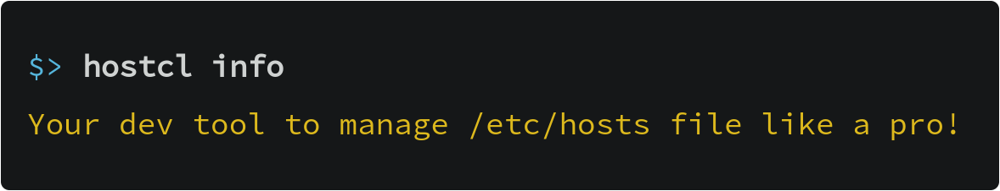

[![Tests][tests-badge]][tests-link]
[![GitHub Release][release-badge]][release-link]
[![Go Report Card][report-badge]][report-link]
[![License][license-badge]][license-link]
[![All Contributors][all-contributors-badge]][all-contributors-link]
[![Coverage][coverage-badge]][coverage-link]

# hostctl

This tool gives you more control over the use of your hosts file. 
You can have multiple profiles and switch them on/off as you need.

## Why?

It is a tedious task to handle the `hosts` file by editing manually.
With this tool you can automate some aspects to do it cleaner and quick. 

## Features

  * Manage groups of host names by profile.
  * Enable/disable complete profiles.
  * Add/remove groups of host names.
  * Add profiles directly from a text file that you can add to your git repo or any VCS.
  * Sync a profile with Docker or Docker Compose containers.
  

## Documentation

You can read about how to use this tool here:

* [Getting started guide](http://guumaster.github.io/hostctl/docs/getting-started/) 
* [Usage Guides](http://guumaster.github.io/hostctl/docs/guides/)
* [CLI commands, options and flags](http://guumaster.github.io/hostctl/docs/cli-usage/)

Or you can start directly on the [Docs homepage](http://guumaster.github.io/hostctl/).

## Sample Usage

## Installation

Go to [release page](https://github.com/guumaster/hostctl/releases) and download the binary you prefer.

Or read about other installation methods on different systems [here](http://guumaster.github.io/hostctl/docs/installation/)

## Linux/Mac/Windows and permissions

The tool recognize your system and use the right hosts file, it will use `/etc/hosts` on Linux/Mac and `C:/Windows/System32/Drivers/etc/hosts` on Windows.

**SUDO/ADMIN**: You will need permissions for any action that modify hosts file, add `sudo` to the commands below when needed. If you are on windows, make sure you run it as administrator.

**WARNING**: it should work on any system. It's tested on Ubuntu and Windows 10. If you can confirm it works on other system, please let me know [here](https://github.com/guumaster/hostctl/issues/new).

## Contributing

Be sure to read [CONTRIBUTING](CONTRIBUTING.md) and [CODE_OF_CONDUCT](CODE_OF_CONDUCT.md).

## Contributors ✨

Thanks goes to these wonderful people ([emoji key](https://allcontributors.org/docs/en/emoji-key)):

<!-- ALL-CONTRIBUTORS-LIST:START - Do not remove or modify this section -->
<!-- prettier-ignore-start -->
<!-- markdownlint-disable -->
<table>
  <tr>
    <td align="center"><a href="https://github.com/gkze"> <b>George Kontridze</b></a> <a href="https://github.com/guumaster/hostctl/commits?author=gkze" title="Code">💻</a></td>
    <td align="center"><a href="https://github.com/pacodes"> <b>Pacodes</b></a> <a href="https://github.com/guumaster/hostctl/commits?author=pacodes" title="Tests">⚠️</a> <a href="https://github.com/guumaster/hostctl/commits?author=pacodes" title="Code">💻</a></td>
    <td align="center"><a href="https://772424.com"> <b>BarbUk</b></a> <a href="https://github.com/guumaster/hostctl/commits?author=BarbUk" title="Code">💻</a> <a href="#ideas-BarbUk" title="Ideas, Planning, & Feedback">🤔</a></td>
    <td align="center"><a href="https://github.com/devopsbrett"> <b>Brett Mack</b></a> <a href="https://github.com/guumaster/hostctl/commits?author=devopsbrett" title="Code">💻</a></td>
    <td align="center"><a href="https://peterthaleikis.com"> <b>Peter Thaleikis</b></a> <a href="https://github.com/guumaster/hostctl/commits?author=spekulatius" title="Code">💻</a> <a href="https://github.com/guumaster/hostctl/commits?author=spekulatius" title="Documentation">📖</a></td>
    <td align="center"><a href="https://github.com/smhmd"> <b>simohamed</b></a> <a href="#ideas-smhmd" title="Ideas, Planning, & Feedback">🤔</a> <a href="https://github.com/guumaster/hostctl/commits?author=smhmd" title="Code">💻</a></td>
    <td align="center"><a href="https://github.com/fabiang"> <b>Fabian Grutschus</b></a> <a href="#ideas-fabiang" title="Ideas, Planning, & Feedback">🤔</a></td>
  </tr>
</table>

<!-- markdownlint-enable -->
<!-- prettier-ignore-end -->
<!-- ALL-CONTRIBUTORS-LIST:END -->

This project follows the [all-contributors](https://github.com/all-contributors/all-contributors) specification. Contributions of any kind welcome!

## Author(s)

* [guumaster](https://github.com/guumaster)

## LICENSE

 [MIT license](LICENSE)

<!-- JUST BADGES & LINKS -->
[tests-badge]: https://img.shields.io/github/workflow/status/guumaster/hostctl/Test
[tests-link]: https://github.com/guumaster/hostctl/actions?query=workflow%3ATest

[release-badge]: https://img.shields.io/github/release/guumaster/hostctl.svg?logo=github&labelColor=262b30
[release-link]: https://github.com/guumaster/hostctl/releases

[report-badge]: https://goreportcard.com/badge/github.com/guumaster/hostctl
[report-link]: https://goreportcard.com/report/github.com/guumaster/hostctl

[license-badge]: https://img.shields.io/github/license/guumaster/hostctl
[license-link]: https://github.com/guumaster/hostctl/blob/master/LICENSE

[coverage-badge]: https://sonarcloud.io/api/project_badges/measure?project=guumaster_hostctl&metric=coverage
[coverage-link]: https://sonarcloud.io/dashboard?id=guumaster_hostctl

<!-- ALL-CONTRIBUTORS-BADGE:START - Do not remove or modify this section -->
[all-contributors-badge]: https://img.shields.io/badge/contributors-7-blue.svg
<!-- ALL-CONTRIBUTORS-BADGE:END -->
[all-contributors-link]: #contributors-
